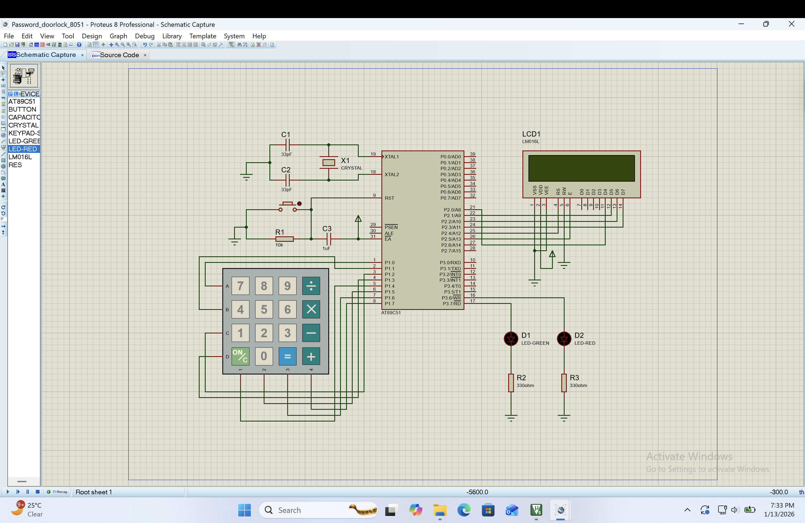
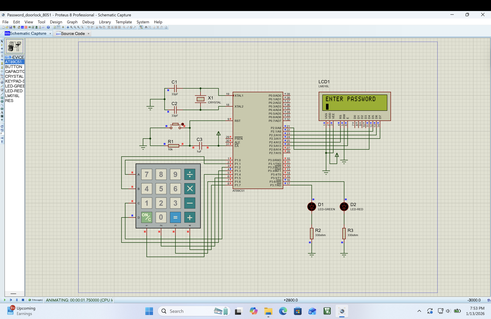

# 🔐 Password Protected Door Lock System using 8051


A secure password-protected door lock system implemented using the 8051 microcontroller (AT89C51). The system authenticates users via a 4-digit password entered through a 4x4 matrix keypad, displays status on a 16x2 LCD, and provides visual feedback through LED indicators.

---

## 📋 Table of Contents

- [Features](#-features)
- [Circuit Diagram](#-circuit-diagram)
- [Hardware Components](#-hardware-components)
- [Pin Configuration](#-pin-configuration)
- [Software Requirements](#-software-requirements)
- [Project Structure](#-project-structure)
- [How It Works](#-how-it-works)
- [Installation & Usage](#-installation--usage)
- [Screenshots](#-screenshots)
- [Future Enhancements](#-future-enhancements)
- [Author](#-author)

---

## ✨ Features

- **4-Digit Password Authentication** — Secure access control with predefined password
- **Password Masking** — Displays `*` for each digit entered (enhanced security)
- **16x2 LCD Display** — Real-time status feedback in 4-bit mode
- **LED Indicators** — Green LED for access granted, Red LED for access denied
- **Auto-Reset** — System automatically resets for next entry after each attempt
- **Debounced Keypad** — Reliable key detection with software debouncing
- **Modular Code** — Separate header files for LCD and keypad functions

---

## 🔌 Circuit Diagram



### System Architecture

```
+---------------------------------------------------------------------+
|                            AT89C51                                  |
|                        Microcontroller                              |
|                                                                     |
|   +---------+                                    +---------+        |
|   |   4x4   |-------- P1.0-P1.7                  |   16x2  |        |
|   | Keypad  |                                    |   LCD   |        |
|   +---------+         P2.0-P2.3 (Data D4-D7) --- |         |        |
|                       P2.4 (RS), P2.5 (EN) ----- |         |        |
|                                                  +---------+        |
|                                                                     |
|                       P3.7 ------------------------> Green LED      |
|                       P3.6 ------------------------> Red LED        |
+---------------------------------------------------------------------+
```

---

## 🛠 Hardware Components

| Component | Specification | Quantity |
|-----------|---------------|----------|
| Microcontroller | AT89C51 / P89V51RD2 | 1 |
| LCD Display | 16x2 Character LCD (LM016L) | 1 |
| Keypad | 4x4 Matrix Keypad | 1 |
| LED | Green (5mm) | 1 |
| LED | Red (5mm) | 1 |
| Crystal Oscillator | 11.0592 MHz | 1 |
| Capacitor | 33pF (for crystal) | 2 |
| Capacitor | 1µF (electrolytic) | 1 |
| Resistor | 10KΩ (pull-up for reset) | 1 |
| Resistor | 330Ω (for LEDs) | 2 |
| Power Supply | 5V DC | 1 |

---

## 📌 Pin Configuration

### Microcontroller Pin Mapping

| Port | Pin | Function | Connected To |
|------|-----|----------|--------------|
| **P1.0** | 1 | Row 1 | Keypad R1 |
| **P1.1** | 2 | Row 2 | Keypad R2 |
| **P1.2** | 3 | Row 3 | Keypad R3 |
| **P1.3** | 4 | Row 4 | Keypad R4 |
| **P1.4** | 5 | Column 1 | Keypad C1 |
| **P1.5** | 6 | Column 2 | Keypad C2 |
| **P1.6** | 7 | Column 3 | Keypad C3 |
| **P1.7** | 8 | Column 4 | Keypad C4 |
| **P2.0** | 21 | Data D4 | LCD D4 |
| **P2.1** | 22 | Data D5 | LCD D5 |
| **P2.2** | 23 | Data D6 | LCD D6 |
| **P2.3** | 24 | Data D7 | LCD D7 |
| **P2.4** | 25 | RS | LCD RS |
| **P2.5** | 26 | Enable | LCD EN |
| **P3.6** | 16 | LED Control | Red LED (Access Denied) |
| **P3.7** | 17 | LED Control | Green LED (Access Granted) |

### LCD Pin Configuration (4-bit Mode)

| LCD Pin | Function | Connection |
|---------|----------|------------|
| VSS | Ground | GND |
| VDD | Power | +5V |
| VEE | Contrast | Potentiometer |
| RS | Register Select | P2.4 |
| RW | Read/Write | GND (Write only) |
| EN | Enable | P2.5 |
| D4-D7 | Data Lines | P2.0-P2.3 |

---

## 💻 Software Requirements

| Software | Purpose | Version |
|----------|---------|---------|
| **Keil µVision** | Code development & compilation | v5.x |
| **Proteus 8** | Circuit simulation | v8.x |
| **Hex File** | For flashing to hardware | Generated by Keil |

---

## 📁 Project Structure

```
8051_Password_Door_Lock/
│
├── src/
│   └── Password_Door_lock.c    # Main source code
│
├── include/
│   ├── lcd4bit.h               # LCD driver (4-bit mode)
│   └── keypad.h                # 4x4 Keypad scanner
│
├── proteus/
│   └── Password_doorlock_8051.pdsprj   # Proteus simulation file
│
├── docs/
│   └── Screenshots/
│       ├── 01_enter_password.png
│       ├── 02_access_granted.png
│       └── 03_access_denied.png
│
├── .gitignore
└── README.md
```

---

## ⚙ How It Works

### System Flow

```
      +------------------+
      |   System Start   |
      +--------+---------+
               |
               v
      +------------------+
      |  Initialize LCD  |
      |    Display:      |
      | "ENTER PASSWORD" |
      +--------+---------+
               |
               v
      +------------------+
      |  Wait for Key    |<-----------------+
      |     Press        |                  |
      +--------+---------+                  |
               |                            |
               v                            |
      +------------------+                  |
      |   Display '*'    |                  |
      |   Store digit    |                  |
      +--------+---------+                  |
               |                            |
               v                            |
         +-----------+                      |
         | 4 digits  |----No--------------->+
         | entered?  |
         +-----+-----+
               |Yes
               v
         +-----------+
         |  Compare  |
         |  Password |
         +-----+-----+
               |
       +-------+-------+
       |               |
       v               v
   +-------+       +-------+
   | Match |       |  No   |
   |       |       | Match |
   +---+---+       +---+---+
       |               |
       v               v
  +-----------+   +-----------+
  |  "ACCESS  |   |  "ACCESS  |
  |  GRANTED" |   |  DENIED"  |
  | Green ON  |   |  Red ON   |
  +-----------+   +-----------+
```

### Code Logic

1. **Initialization**: LCD and ports are initialized; LEDs are turned OFF
2. **Password Entry**: User enters 4 digits via keypad; each key displays `*`
3. **Validation**: Entered password is compared with stored password (`"1234"`)
4. **Access Granted**: If match → Display "ACCESS GRANTED" → Green LED ON
5. **Access Denied**: If no match → Display "ACCESS DENIED" → Red LED ON
6. **Reset**: After 1 second delay, system resets for next entry

---

## 🚀 Installation & Usage

### Step 1: Clone the Repository

```bash
git clone https://github.com/komal1117/8051_Password_Door_Lock.git
cd 8051_Password_Door_Lock
```

### Step 2: Open in Keil µVision

1. Launch Keil µVision IDE
2. Open Project → Select `Password_Door_lock.uvproj`
3. Build the project (`F7` or Project → Build Target)
4. Locate the generated `.hex` file in `Objects/` folder

### Step 3: Simulate in Proteus

1. Open Proteus 8
2. Load `proteus/Password_doorlock_8051.pdsprj`
3. Double-click the AT89C51 → Load the `.hex` file
4. Click **Run** to start simulation

### Step 4: Test the System

| Action | Expected Result |
|--------|-----------------|
| Enter `1234` | LCD shows "ACCESS GRANTED", Green LED ON |
| Enter `9999` | LCD shows "ACCESS DENIED", Red LED ON |
| Any 4 digits | System validates and resets automatically |

### Changing the Password

To change the default password, modify this line in `Password_Door_lock.c`:

```c
char password[5] = "1234";  // Change "1234" to your desired password
```

---

## 📸 Screenshots

### 1. Initial State — Enter Password Prompt


### 2. Password Entry — Masked Input


### 3. Access Granted — Correct Password


### 4. Access Denied — Wrong Password


---

## 🔮 Future Enhancements

- [ ] **Multiple User Support** — Store multiple passwords in EEPROM
- [ ] **Password Change Feature** — Allow admin to change password via keypad
- [ ] **Lockout Mechanism** — Lock system after 3 wrong attempts
- [ ] **Buzzer Alert** — Audio feedback for wrong password
- [ ] **Door Motor Integration** — Connect DC motor/servo for actual door control
- [ ] **RFID Integration** — Add RFID card as secondary authentication
- [ ] **Real-Time Clock** — Log access times
- [ ] **GSM Module** — Send SMS alerts on unauthorized access

---

## 🧠 Key Learning Outcomes

This project demonstrates:

- 8051 Microcontroller programming in Embedded C
- LCD interfacing in 4-bit mode
- 4x4 Matrix keypad scanning technique
- GPIO configuration and control
- Password validation logic
- Modular code organization with header files
- Proteus simulation for embedded systems

---

## 📚 References

- [8051 Microcontroller Architecture](https://www.electronicshub.org/8051-microcontroller-architecture/)
- [LCD 4-bit Mode Interfacing](https://www.engineersgarage.com/microcontroller/8051projects/interface-lcd-in-4-bit-mode-with-8051/)
- [4x4 Keypad Interfacing](https://www.electronicwings.com/8051/keypad-interfacing-with-8051)

---

## 👩‍💻 Author

**Komal Patkar**

- 🎓 PG Diploma in Embedded Systems & PCB Design — NITTSD
- 🎓 M.Sc. Mathematics & Computing — IIT Guwahati
- 🎓 B.Sc. Mathematics — Savitribai Phule Pune University (SSR College, Silvassa, DD&DNH)
- 💼 GitHub: [@komal1117](https://github.com/komal1117)
- 📧 Email: patkarkomal1517@gmail.com

---

## 📄 License

This project is licensed under the MIT License — see the [LICENSE](LICENSE) file for details.

---

<p align="center">
  ⭐ Star this repository if you found it helpful! ⭐
</p>
